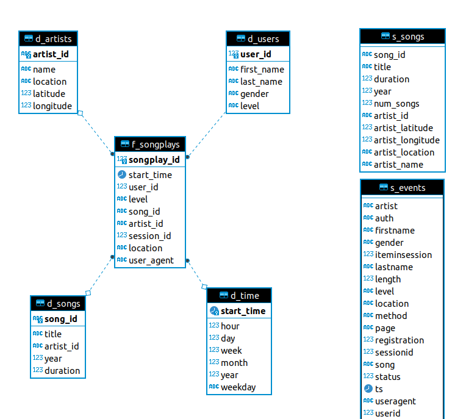

# Cloud Data Warehouse with AWS Redshift
### A project submitted as work for Udacity's Data Engineering Nano Degree

## Introduction
Sparkify is a startup providing music streaming service. Their application stores data in JSON format. 

We want to use Redshift on AWS to analyze the user data and log data to better understand the listening trends of our users. 

## Summary
We are building a data warehouse on AWS's Redshift platform. 
We load "song data" and "log data" (JSON files) from S3 bucket into staging tables in redshift cluster. 
Once data is loaded, we can run "ETL" which is a process of transforming and loading data in fact and dimension tables via sql. 
All steps are executed via run-dwh.sh file which then calls dwh-main.py which call the necessary python functions. 


## Star Schema



### Staging Tables - s_songs, s_events:
* staging table `s_songs` follows the structure of the song data: 
    ```
    {
        "num_songs": 1, 
        "artist_id": "ARJIE2Y1187B994AB7", 
        "artist_latitude": null, 
        "artist_longitude": null, 
        "artist_location": "", 
        "artist_name": "Line Renaud", 
        "song_id": "SOUPIRU12A6D4FA1E1", 
        "title": "Der Kleine Dompfaff", 
        "duration": 152.92036, 
        "year": 0
    }
    ```
* staging table `s_events` follow the structure of the log data:
    ```
    {
        "artist":"Des'ree",
        "auth":"Logged In",
        "firstName":"Kaylee",
        "gender":"F",
        "itemInSession":1,
        "lastName":"Summers",
        "length":246.30812,
        "level":"free",
        "location":"Phoenix-Mesa-Scottsdale, AZ",
        "method":"PUT",
        "page":"NextSong",
        "registration":1540344794796.0,
        "sessionId":139,
        "song":"You Gotta Be",
        "status":200,
        "ts":1541106106796,
        "userAgent":"\"Mozilla\/5.0 (Windows NT 6.1; WOW64) AppleWebKit\/537.36 (KHTML, like Gecko) Chrome\/35.0.1916.153 Safari\/537.36\"",
        "userId":"8"
    }
    ```
* the redshift `copy` command is used to enable fast loading of these files into their respective tables

### Fact Table f_songplays:
* using `start_time` as distkey as it is a very large dimenstion and it is likely to grow rapidly but evenly as we get more event data
* using `start_time` as sortkey to make "trend" analysis faster

### Dimension Tables d_artists, d_users, d_songs and d_time:
* d_artists:
    - each row describes a unique artist
    - `d_artists.artist_id` is the primary key
    - `d_artists.name` is sortkey, this is to aid with analysis of which artists / titles are trending

* d_users: 
    - each row describes a unique user
    - `d_users.user_id` is the primary key
    - `d_users.level` is a sortkey to aid with analysis of who upgrades from "Free" to "Paid"

* d_songs:
    - each row describes a unique song
    - `d_songs.song_id` is a primary key
    - `d_songs.title` is a sortkey to aid with analysis of which titles are trending

* d_time: 
    - each row describes a unique timestamp found in the log data
    - `start_time` (epoch time format) is primary key, sortkey and distkey
    - distkey on `start_time` because we have that in the fact table `f_songplays` as well
    - sortkey on `start_time` to aid with trending analysis  

## ETL Pipeline 

* Song dataset (json) is loaded into staging table s_songs using redshift's copy command 
* Log dataset (json) is loaded into staging table s_events using redshift's copy command 
* Data from staging tables are transformed and loaded into fact and dimension tables using sql


## How to run

### Create your own Redshift cluster on AWS
* create your own redshift cluster by going into AWS Console or using AWS CLI
* You can also use my [aws-iac-redshift](https://github.com/firozkabir/aws-iac-redshift) project to create a cluster using Infrastructure as Code. 


### Clone this repository
```bash
git clone git@github.com:firozkabir/data-warehouse-redshift.git
```


### Add the Redshift credentials to dwh.cfg
```
[CLUSTER]
HOST=
DB_NAME=
DB_USER=
DB_PASSWORD=
DB_PORT=

[IAM_ROLE]
ARN=

[S3]
LOG_DATA=s3://udacity-dend/log_data
LOG_JSONPATH=s3://udacity-dend/log_json_path.json
SONG_DATA=s3://udacity-dend/song_data
```

### Install virtual Environment
```bash
cd data-warehouse-redshift
virtualenv -p /usr/bin/python3 venv
source venv/bin/activate
pip3 install -r requirements.txt
```


### Create the database schema in Redshift
```bash
./run-dwh.sh create_schema
```


### Load data into staging and run ETL process
```bash
./run-dwh.sh do_etl
```


### Don't forget to delete the cluster when you are done.
